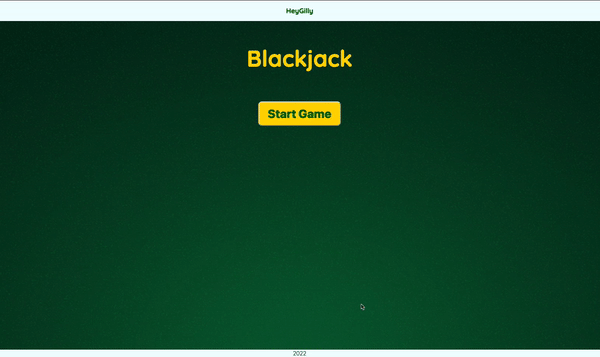

<h1 align="center">
   
  
   
  Passenger Counter
   
</h1>

<h4 align="center">
This application is the legendary card game Blackjack (twenty-one), built with CSS & Vanilla Javascript. The purpose of the game is to be dealt cards having a higher count than those of the dealer, however not exceeding 21.  
</h4>

## Live View
- <a href="https://blackjack-gilly.netlify.app/"> Click Here</a>

## Languages

The languages used to create this application:
- HTML
- CSS
- Vanilla Javascript

## Pathway

* [X] Think of how you want to display this. 
* [X] Get a background image
* [X] Add google font
* [X] Create navigation Bar with an anchor Name 
* [X] Create a Title
* [X] Put content on page
  * dealers side
  * players side
  * hit button
  * stay button
  * start button
* [X] Style the content of the page
* [X] work with JS to make it functional
  * hide The main
  * When you push start button, start button disappears and main appears with a startGame()
  * Create a function that generate two random numbers for the user's card
  * Create another function that will continue with the game. 
  * Start of game the message alert should be clear
  * Hide the Ace Card Container that will pop up when an Ace appears
  * calculate the sum of the cards for user
  * create a render function that will take the sum of the user cards and see if they have 21, under or higher. message will be based on results.
    * 21 will have message display blackjack and stay and hit button will be hidden. 
    * Under: message will ask for another card, stay hit button will show
      * hit button will run function newCard
    * Higher: message will say busted and start game will appear and star and hit will be hidden
  * Creating a function called newCard
    * this will add a number at the users card text
  * Now input the dealers random number amount, sum it up
  * Create a function called whoWon that will check to see who won the dealer or user. 
    * will be added to equal to 21, and if they click the stay button. 
    * if busted you automatically lose.
  * Create a function that will add a new card if the dealer sum is less than 16
---

> Linkedin [/HeyGilly](https://www.linkedin.com/in/heygilly) &nbsp;&middot;&nbsp;
> GitHub [@HeyGilly](https://github.com/HeyGilly) &nbsp;&middot;&nbsp;